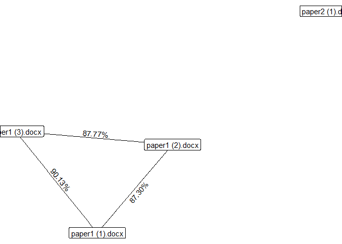

<!-- README.md is generated from README.Rmd. Please edit that file -->

# cheatR: Catch ’em baddies 

This is a mini package to help you find cheaters by comparing
hand-ins\!  
([Read
more](https://shouldbewriting.netlify.com/posts/2018-07-29-cheatr/)
about the circumstances that brought about the development of this
package.)

## Download and Install

You can install `cheatR` from
[github](https://github.com/mattansb/cheatR) with:

``` r
# install.packages("devtools")
devtools::install_github("mattansb/cheatR")
```

## Example usage

<!-- generated from the vignette. Please see that file -->

### Scripting

Create a list of files:

``` r
my_files <- list.files(path = '../doc', pattern = '.doc', full.names = T)
my_files
#> [1] "../doc/paper1 (1).docx" "../doc/paper1 (2).docx"
#> [3] "../doc/paper1 (3).docx" "../doc/paper2 (1).doc"
```

The first 3 documents are different drafts of the same paper, so we
would expect them to be similar to each other. The last document is a
draft of a different paper, so it should be dissimilar to the first 3.
**All files are about 45K words long.**

Now we can use `cheatR` to find duplicates.

The only function, `catch_em`, takes the following input arguments:

  - `flist` - a list of documents (`.doc`/`.docx`/`.pdf`). A
    full/relative path must be provided.
  - `n_grams` - see [`ngram`
    package](https://github.com/wrathematics/ngram).
  - `time_lim` - max time in seconds for each comparison (we found that
    some corrupt files run forever and crash R, so a time limit might be
    needed).

<!-- end list -->

``` r
library(cheatR)
#> Registered S3 method overwritten by 'R.oo':
#>   method        from       
#>   throw.default R.methodsS3
#> Catch 'em cheaters!
results <- catch_em(flist = my_files,
                    n_grams = 10, time_lim = 1) # defults
#> Reading documents... Done!
#> Looking for cheaters
#> ===========================================================================
#> Busted!
```

The resulting list contains a matrix with the similarity values between
each pair of documents:

``` r
knitr::kable(summary(results))
```

|                 | paper1 (1).docx | paper1 (2).docx | paper1 (3).docx | paper2 (1).doc |
| --------------- | --------------: | --------------: | --------------: | -------------: |
| paper1 (1).docx |           1.000 |                 |                 |                |
| paper1 (2).docx |           0.873 |           1.000 |                 |                |
| paper1 (3).docx |           0.901 |           0.878 |           1.000 |                |
| paper2 (1).doc  |           0.002 |           0.002 |           0.002 |              1 |

You can also plot the relational graph if you’d like to get a more clear
picture of who copied from who.

``` r
plot(results, weight_range = c(0.7, 1))
#> Using `nicely` as default layout
```

<!-- -->

### Shiny app\!

The accompanying `Shiny` app can be found on
[shinyapps.io](https://almogsi.shinyapps.io/cheatR/), but can also be
run locally with:

``` r
cheatR::catch_em_app()
```


## Limitations?

  - As far as we can tell, this should work on any language; we tried
    both English and Hebrew, with and without setting
    `Sys.setlocale("LC_ALL", "Hebrew")`.  
  - Best performance was achieved on `R` version \> 3.5.0.

## Authors

  - **Mattan S. Ben-Shachar** \[aut, cre\].
  - **Almog Simchon** \[aut, cre\].
